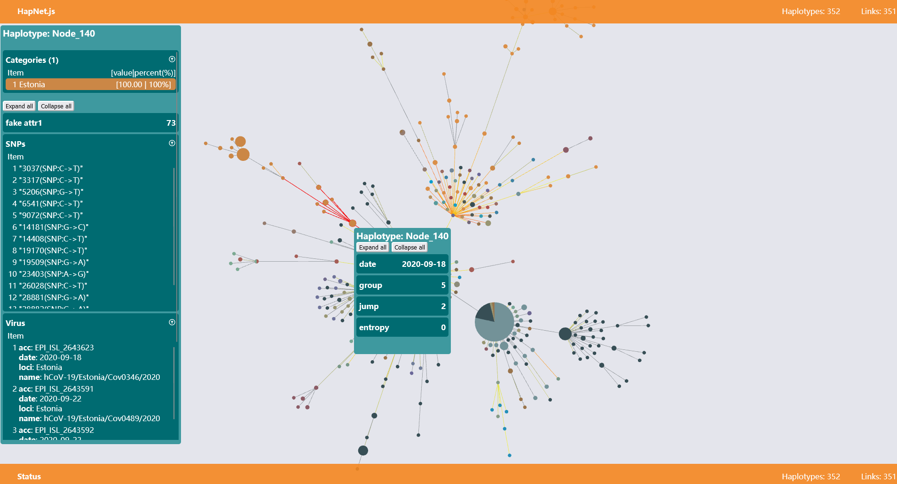

# HapNet.js

## Introduction

HapNet.js is a javaScript library to draw haplotype network in a fast way. Unlike other general visualizition libraries,
HapNet.js provides a series of features especially designed for visulize haplotype network.

## Features

1. Visualization functions are based on webGL technique([pixi.js](https://pixijs.com/)) to accelerate large haplotype
   network.
2. Coarser graph is used to initialize position of each node, which is useful to reduce the full graph level
   interactions.
3. Palettes compatible with several journals are embedded. Custom palettes are also permitted.
4. UI panels are built to show detailed information both for haplotypes and links.

[demo](https://ngdc.cncb.ac.cn/ccas/hapnetjs/index.html)

## How to use

## API reference
